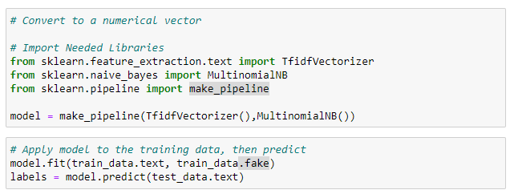
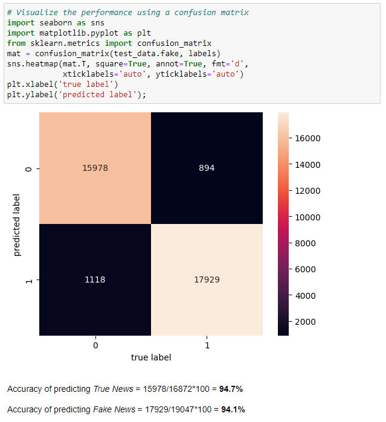

# Fake-News-Text-Classifier
I take a Multinomial Naive Bayes classification approach to build a Fake News Text Classifier

In recent year the rise of social media took the world by storm. It became increasingly easier to share one’s views and opinions on any matter. People end up getting bombarded with all kinds of information. The need to distinguish between what is accurate and what is fictional, is becoming a bigger and bigger priority. The Aim of this project is to find out if, through the use of Natural Language Processing, it’s possible to create a classifier that can, to a reasonable degree of accuracy predict weather a news statement is in fact true of false.

## Classification Approach

### Multinomial Naive Bayes

We'll make use of a Multinomial Naive Bayes classification approach. This differs to the traditional Gaussian approach to Naive Bayes in that, we assume that the features are generated from a multinomial distribution.

In this approach, we're basically looking at the probability of observing counts across two main categories, namely fake news and accurate news. We then do our modeling by finding a best-fit multinomial distribution.

Multinomial Naive Bayes is a very suitable approach for this type of text classification where we're taking a fragment of text, or a blog post, or a passage of text, and we're trying to classify it according to some topical scheme.

In this problem, the inside the two categories we are essentially looking at the word types, so all the different words that you might have in your vocabulary, data types and data categories. We then make use of the multinomial distribution to basically observing the counts across these various word types.

### TfidfVectorizer

When dealing with textual data, one can't use it in its raw form in one's models. We have to convert it to some numerical form, and one of the best ways of doing this by using approach which is called the TfidfVectorizer.
In the following blocks of code, we'll make use of a TfidfVectorizer. We'll then import multinomial Naive Bayes(MultinomialNB) as our model. We'll put these two objects into a pipeline (make_pipeline). We will fit training data to the model, and then generate some labels by calling the predict method on the test data.

### Confusion Matrix

